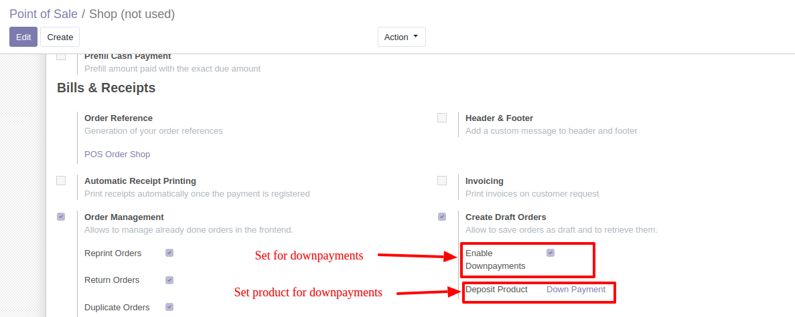
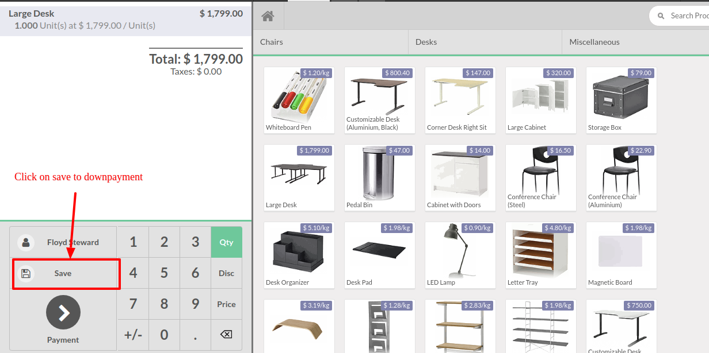
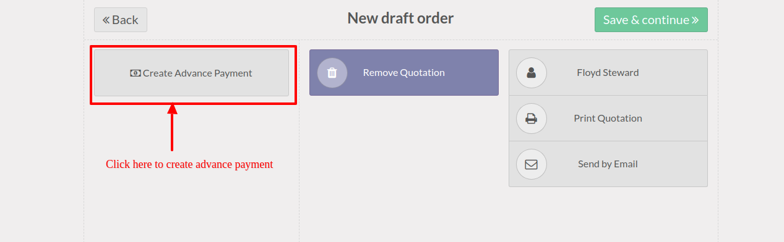
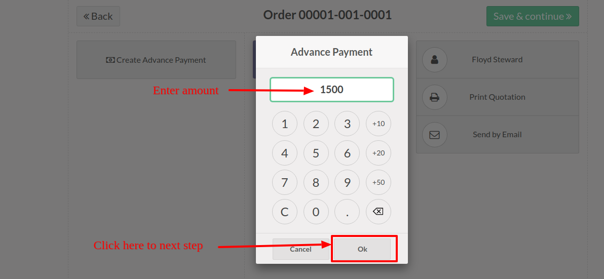
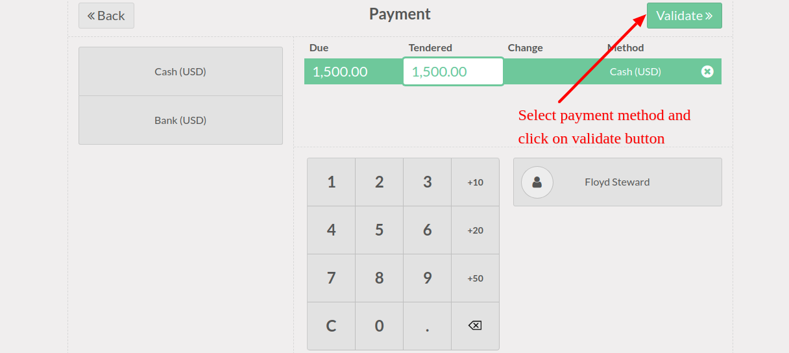
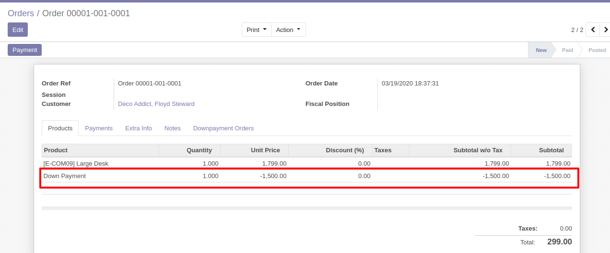
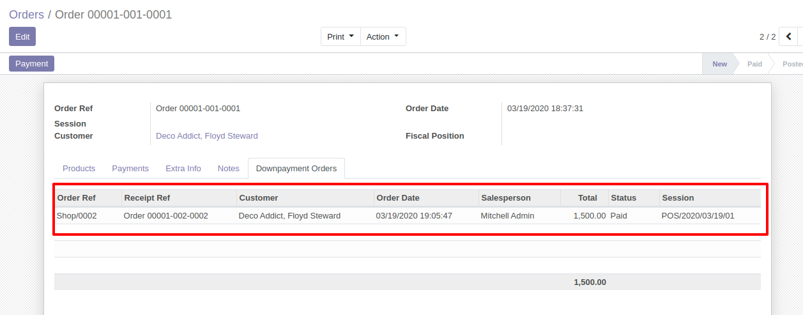

======================================
POS Order Management Draft Downpayment
======================================
Allows create down payments orders on POS.
This module extends `pos_order_mgmt_draft`

Configure the Point of Sale
---------------------------
Menu: Point of Sale > Configuration > Point of Sale

|
|
|

Allow to process for downpayment
--------------------------------

|
|
|

Create advance payment
----------------------

|
|
|

Enter amount for advance payment
--------------------------------

|
|
|

Select Payment method
---------------------

|
|
|

POS order with downpayment
--------------------------

|
|
|

Credits
=======

Authors
~~~~~~~

* Druidoo

Contributors
~~~~~~~~~~~~

* Iván Todorovich <ivan.todorovich@druidoo.io>

Maintainers
~~~~~~~~~~~

.. |maintainer-ivantodorovich| image:: https://github.com/ivantodorovich.png?size=40px
    :target: https://github.com/ivantodorovich
    :alt: ivantodorovich

Current maintainer:

|maintainer-ivantodorovich| 

